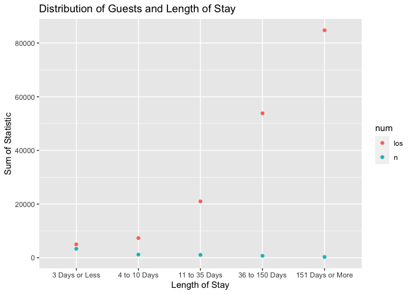
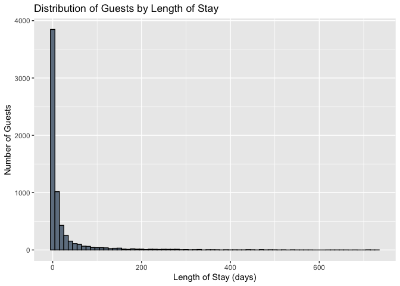

<center>

## { width=5% } Harvard Kennedy School
***
### API 201Z: Fall 2020
#### Problem Set #1 - March 26, 2020
#### __Nolin Greene__

</center>

__Question #1: Case Study - Pine Street Inn__

*Data and Package Loading (output masked for readability purposes)*


```r
rm(list=ls())

options(scipen = 999)

library(readxl);library(dplyr);library(ggplot2);
library(tidyr);library(knitr);library(kableExtra)

d<-read_excel("Pine Street Inn Length of Stay Data - Solutions.xls", 
              sheet = 1, cell_cols(1:2))

colnames(d)<-c("n","los")
```
*1.1:* The mean length of stay at Pine Street Inn is **26 days**. 

*1.2:* The median length of stay at Pine Street Inn is **3 days**. 

*1.3:* The maximum length of stay at Pine Street Inn is **727 days** and the minimum length of stay is **1 day**. 

*1.4:* The 75th percentile length of stay at Pine Street Inn is **17 days.**  The 95th and 99th percentiles are **65 days** and **138 days** respectively

*1.5:* There are **171905 bednights** represented in the dataset.

*1.6:* There are **6556 guests** represented in the dataset.

*1.7* 

```r
d%>%
  filter(los<=3) %>%
  summarize(n=n(), bednights=sum(los))
```

```
## # A tibble: 1 x 2
##       n bednights
##   <int>     <dbl>
## 1  3322      4973
```

```r
d%>%
  filter(los<=10 & los>3) %>%
  summarize(n=n(), bednights=sum(los))
```

```
## # A tibble: 1 x 2
##       n bednights
##   <int>     <dbl>
## 1  1177      7328
```

```r
d%>%
  filter(los<=35 & los>10) %>%
  summarize(n=n(), bednights=sum(los))
```

```
## # A tibble: 1 x 2
##       n bednights
##   <int>     <dbl>
## 1  1048     21007
```

```r
d%>%
  filter(los<=150 & los>35) %>%
  summarize(n=n(), bednights=sum(los))
```

```
## # A tibble: 1 x 2
##       n bednights
##   <int>     <dbl>
## 1   721     53832
```

```r
d%>%
  filter(los>150) %>%
  summarize(n=n(), bednights=sum(los))
```

```
## # A tibble: 1 x 2
##       n bednights
##   <int>     <dbl>
## 1   288     84765
```


### Summary Statistics for PSI Length of Stay
<table class="table table-striped table-hover table-condensed" style="margin-left: auto; margin-right: auto;">
 <thead>
  <tr>
   <th style="text-align:left;">   </th>
   <th style="text-align:left;"> Number of <br>Guests </th>
   <th style="text-align:left;"> Number of <br>Bed Nights </th>
   <th style="text-align:left;"> Fraction <br>of Guests </th>
   <th style="text-align:left;"> Fraction of <br>Bed Nights </th>
   <th style="text-align:left;"> Avg Bed Nights <br> per Guest </th>
  </tr>
 </thead>
<tbody>
  <tr>
   <td style="text-align:left;"> 3 Days or Less </td>
   <td style="text-align:left;"> 721 </td>
   <td style="text-align:left;"> 4973 </td>
   <td style="text-align:left;"> 0.11 </td>
   <td style="text-align:left;"> 0.03 </td>
   <td style="text-align:left;"> 1 </td>
  </tr>
  <tr>
   <td style="text-align:left;"> 4 to 10 Days </td>
   <td style="text-align:left;"> 1177 </td>
   <td style="text-align:left;"> 7328 </td>
   <td style="text-align:left;"> 0.18 </td>
   <td style="text-align:left;"> 0.04 </td>
   <td style="text-align:left;"> 6 </td>
  </tr>
  <tr>
   <td style="text-align:left;"> 11 to 35 Days </td>
   <td style="text-align:left;"> 1048 </td>
   <td style="text-align:left;"> 21007 </td>
   <td style="text-align:left;"> 0.16 </td>
   <td style="text-align:left;"> 0.12 </td>
   <td style="text-align:left;"> 20 </td>
  </tr>
  <tr>
   <td style="text-align:left;"> 36 to 150 Days </td>
   <td style="text-align:left;"> 721 </td>
   <td style="text-align:left;"> 53832 </td>
   <td style="text-align:left;"> 0.11 </td>
   <td style="text-align:left;"> 0.31 </td>
   <td style="text-align:left;"> 75 </td>
  </tr>
  <tr>
   <td style="text-align:left;"> 151 Days or More </td>
   <td style="text-align:left;"> 288 </td>
   <td style="text-align:left;"> 84765 </td>
   <td style="text-align:left;"> 0.04 </td>
   <td style="text-align:left;"> 0.49 </td>
   <td style="text-align:left;"> 294 </td>
  </tr>
  <tr>
   <td style="text-align:left;"> Total </td>
   <td style="text-align:left;"> 3955 </td>
   <td style="text-align:left;"> 171905 </td>
   <td style="text-align:left;">  </td>
   <td style="text-align:left;">  </td>
   <td style="text-align:left;">  </td>
  </tr>
</tbody>
</table>

*1.8:* 

```r
d<-d %>%
  mutate(bin = case_when(
      los<4 ~ "3 Days or Less",
      los>3 & los<11 ~ "4 to 10 Days",
      los>10 & los <36 ~ "11 to 35 Days",
      los>35 & los<151 ~"36 to 150 Days",
      los>150 ~ "151 Days or More"),
    bin = factor(bin, levels = c("3 Days or Less","4 to 10 Days","11 to 35 Days",
                 "36 to 150 Days", "151 Days or More")))

d %>%
  group_by(bin) %>%
  summarize(n=n(), los=sum(los)) %>%
  gather(num, stat,-bin) %>%
  ggplot(aes(x=bin, y= stat, color = num))+
  geom_point()+
  labs(x="Length of Stay", y="Sum of Statistic", title="Distribution of Guests and Length of Stay")
```

<!-- -->


*1.9:* 


```r
ggplot(d, aes(x=los))+
  geom_histogram(colour="black", fill = "slategray", binwidth = 10)+
  labs(x="Length of Stay (days)", y="Number of Guests", title="Distribution of Guests by Length of Stay")
```

<!-- -->

*1.9:* Simply by looking at the mean, one might infer that it is common for a PSI guest to spend 3-4 weeks in shelter. However, upon calculating additional statistics (median, IQR, historgram), we see that the distribution of length of stay is heavily right skewed, with a small number of guests having very long stays. This leads me to believe that Pine Street faces a very severe Pareto Principle, with a small number of guests occupying an extreme proportion of the shelter's total bed stays. 


***

__Question #2: State Spending Data__

*A.* The total direct expenditure was $3.147tr. The total spent on Elementary and Secondary Education was $565bn, the total spent on Health was $84bn and the total spent on Corrections was $72.6bn.

*B.*

```r
temp <- tempfile()
download.file("http://www2.census.gov/govs/local/11statetypepu.zip",temp)
state_exp <- read.table(unz(temp, "11statetypepu.txt"))
colnames(state_exp)<-c("govtype","itemcode","amount", "cv", "yr")
unlink(temp)
```


```r
table(state_exp$yr)
```

```
## 
##    11 
## 30594
```

```r
state_exp<-subset(state_exp, select = -yr)
state_exp<-filter(state_exp, govtype == 1)
state_exp<-subset(state_exp, select = -govtype)
state_exp$amount<-state_exp$amount/1000
state_exp<-state_exp %>%
  mutate(cat = case_when(
      itemcode=="E32" | itemcode=="F32" | itemcode=="G32" ~ "Health",
      itemcode=="E12" | itemcode=="F12" | itemcode=="G12" ~ "Education",
      itemcode=="E04" | itemcode=="F04" | itemcode=="G04" |
      itemcode=="E05" | itemcode=="F05" | itemcode=="G05" ~ "Corrections"))
state_exp<-filter(state_exp, cat %in% c("Health", "Education", "Corrections"))
state_exp %>%
  group_by(cat)%>%
  summarize(sum = sum(amount))
```

```
## # A tibble: 3 x 2
##   cat             sum
##   <chr>         <dbl>
## 1 Corrections  73243.
## 2 Education   565284.
## 3 Health       82392.
```

